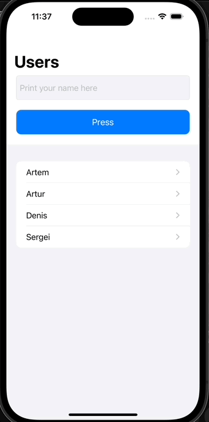

# UserInfo-CoreData-MVP
## Preview
The project contains two screens
## Technology stack
* UIKit
* MVP

## Gif

## Description
* Building UI programmatically
* Using UITableView
* Passing data between ViewControllers
## Requirements
* iOS 16.1
* Xcode 14.0

## Author
artemGalay, iostema@mail.ru
